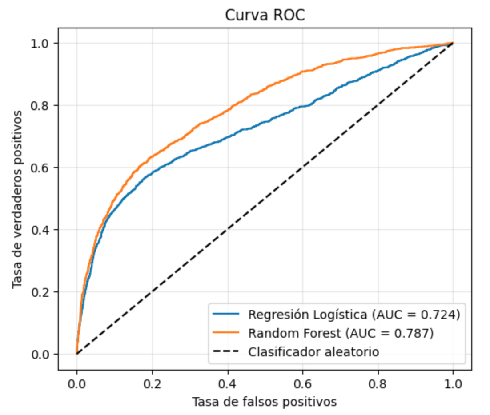
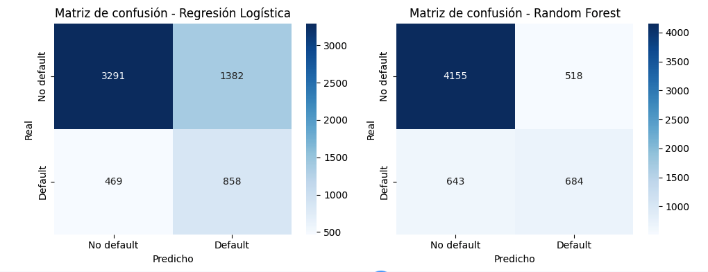
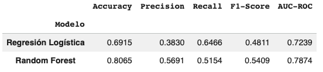

# Credit Risk Prediction using Logistic Regression and Random Forest

Machine Learning project for predicting **credit default risk** using the **UCI Default of Credit Card Clients** dataset. The project compares two supervised classification models—**Logistic Regression** and **Random Forest**—to identify customers with a high probability of defaulting on their credit card payments.

---

## Project Overview

Credit risk modeling is one of the most important applications of Machine Learning in the financial sector. Predictive models help financial institutions estimate the probability that a customer will default on a loan or credit card payment.

This project demonstrates an end-to-end Machine Learning workflow by comparing two classification algorithms and evaluating their performance from both a **technical** and **business** perspective.

## Results Preview

### ROC Curve

<p align="center">

</p>

The ROC curve shows that **Random Forest** achieved a higher discrimination capability (**AUC = 0.787**) than **Logistic Regression (AUC = 0.724)**.

---

### Confusion Matrices

<p align="center">

</p>

The confusion matrices illustrate the trade-off between identifying risky customers and minimizing false alarms.

---
### Performance Metrics

<p align="center">

</p>

Random Forest achieved the highest overall predictive performance, while Logistic Regression obtained the highest Recall for the Default class.

---

## Dataset

**Dataset:** UCI Default of Credit Card Clients

- Source: https://archive.ics.uci.edu/dataset/350/default+of+credit+card+clients
- File used: `UCI_Credit_Card.xls`

The dataset contains demographic information, payment history, bill statements, and previous payment records of credit card clients.

**Target variable**

- **target**
  - 0 → No Default
  - 1 → Default

---

## Technologies

- Python
- NumPy
- Pandas
- Matplotlib
- Seaborn
- Scikit-learn

---

# Machine Learning Workflow

## 1. Exploratory Data Analysis

- Dataset inspection
- Missing values analysis
- Summary statistics
- Target distribution
- Correlation analysis

---

## 2. Data Preprocessing

The preprocessing pipeline includes:

- Feature selection
- One-hot encoding
- Train/Test split
- Feature scaling (Logistic Regression)

---

## 3. Model Training

### Logistic Regression

A multiple binary logistic regression model trained using all available customer features.

Configuration:

```python
LogisticRegression(
    max_iter=1000,
    solver="liblinear",
    class_weight="balanced",
    random_state=67
)
```

---

### Random Forest

A tree-based ensemble classifier trained to improve predictive performance through bootstrap aggregation.

---

## 4. Model Evaluation

The models were evaluated using:

- Accuracy
- Precision
- Recall
- F1-score
- ROC Curve
- ROC-AUC
- Confusion Matrix

---

# Results

| Model | Accuracy | Precision | Recall | F1-Score | ROC-AUC |
|-------|---------:|----------:|--------:|---------:|--------:|
| Logistic Regression | 0.6915 | 0.3830 | **0.6466** | 0.4811 | 0.7239 |
| Random Forest | **0.8065** | **0.5691** | 0.5154 | **0.5409** | **0.7874** |

---

# Results Interpretation

## Logistic Regression

### Strengths

- Highest Recall (**64.66%**)
- Better at identifying customers who actually default
- Suitable for conservative lending strategies

### Limitations

- High number of False Positives
- Many reliable customers are incorrectly classified as risky

---

## Random Forest

### Strengths

- Highest Accuracy
- Highest Precision
- Highest F1-score
- Highest ROC-AUC
- Significantly fewer False Positives

### Limitations

- Lower Recall than Logistic Regression
- Misses more default customers

---

# Business Interpretation

Choosing the best model depends on the organization's objectives.

### If the priority is...

| Business Goal | Recommended Model |
|----------------|-------------------|
| Detect as many defaulters as possible | Logistic Regression |
| Reduce financial losses from defaults | Logistic Regression |
| Maximize overall predictive performance | Random Forest |
| Reduce unnecessary loan rejections | Random Forest |
| Balanced credit approval strategy | Random Forest |

---

# Key Findings

- Random Forest achieved the highest overall predictive performance.
- Logistic Regression achieved the highest Recall.
- Random Forest reduced False Positives by **approximately 63%** (518 vs. 1,382).
- Logistic Regression detected more customers who actually defaulted.
- Random Forest produced a better balance between prediction quality and business impact.
- Model selection should consider business objectives rather than Accuracy alone.

---

# Conclusion

This project demonstrates that the best Machine Learning model depends on the business objective.

Although **Random Forest** achieved the highest Accuracy (**80.65%**), Precision (**56.91%**), F1-score (**54.09%**), and ROC-AUC (**0.787**), **Logistic Regression** obtained the highest Recall (**64.66%**), making it more effective at identifying customers who eventually default.

### Practical implications

- Financial institutions seeking to **maximize default detection** may prefer Logistic Regression.
- Institutions aiming for a **balanced approval strategy** with fewer false alarms may benefit more from Random Forest.

This comparison highlights an important concept in Credit Risk Analytics:

> **The best predictive model is not necessarily the one with the highest Accuracy, but the one that best aligns with the organization's risk management strategy.**


## References

Dataset:
https://archive.ics.uci.edu/dataset/350/default+of+credit+card+clients

---
